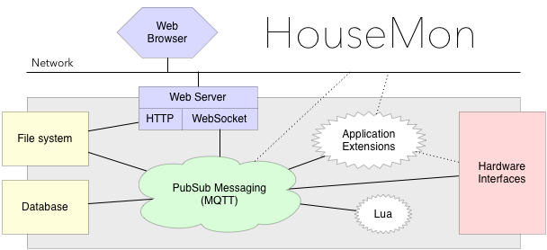

# HouseMon 0.9.x

Real-time home monitoring and automation.

> **This is the DEVELOPMENT branch of HouseMon. See README-0.8 for older info.**

The server side of HouseMon is undergoing some radical changes, such as  
replacing Node.js with an MQTT + LevelDB + Lua server, written in Go.  
This server core architecture is also used in Tosqa and is called "JeeBus".  

# Installation

Right now, you still need all the pieces of 0.8 for development (i.e. Node.js).

In addition, you need to install Go, see <http://golang.org/doc/install>.

Once Go is installed, you need JeeBus, see <https://github.com/jcw/jeebus>.

To launch this early HouseMon 0.9 setup, perform the following steps:

* make sure you're in the HouseMon root directory, next to this README
* launch JeeBus as follows, and keept it running: `jb run :3334`
* in a separate terminal window, launch Node.js as follows: `node .`
* now go to the HouseMon pages by browsing to `localhost:3333` (not a typo)

The definitive way to launch HouseMon will be simplified once the dust settles.

# Documentation

There is a _little_ documentation about HouseMon in the `README-0.md` file.

# License

MIT
